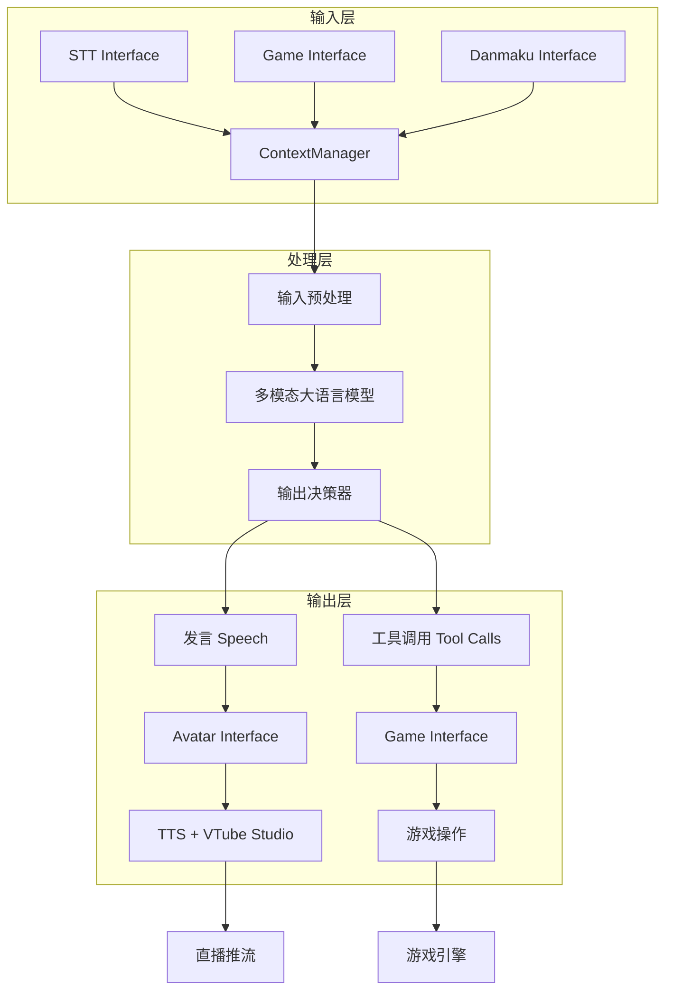
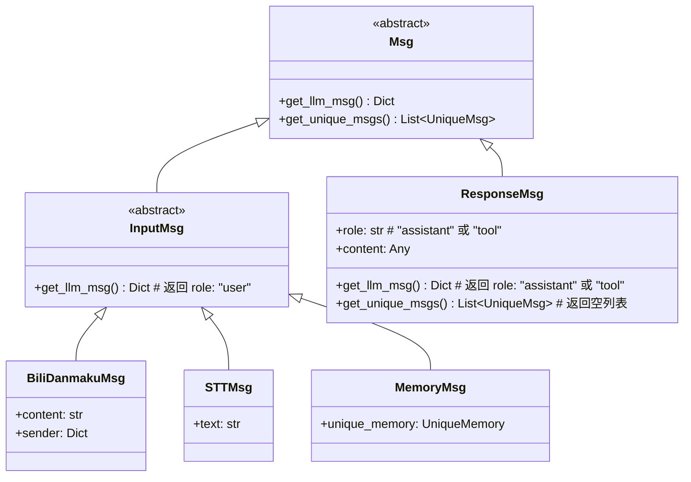

# AI 虚拟主播系统架构设计

## 1. 系统概述

本系统是一个基于多模态大语言模型（Image-Text to Text）的 AI 虚拟主播，支持多种直播平台、多种游戏输入方式，并能够输出发言、感情动作和游戏操作。

### 核心特性

- **多模态输入**：弹幕、游戏画面/状态、STT 语音转文字输入
- **多模态输出**：发言（TTS）、感情动作（VTube Studio）、游戏操作
- **Interface 抽象**：每个 Interface 提供自己的工具描述
- **Async 架构**：所有操作返回 awaitable，支持并发
- **消息去重**：UniqueMsg 自动去重唯一消息，节省 tokens
- **持久记忆**：MemoryInterface 支持跨直播会话保存关键信息

## 2. 系统架构图



## 3. 模块设计

### 3.1 Interface 抽象基类

```python
from abc import ABC, abstractmethod
from typing import List, Dict, Any, Awaitable, Optional, Tuple, Callable
import asyncio
from .oai_tool import OAIFunction

class Interface(ABC):
    """Interface 抽象基类
    
    所有模块（STT、Game、Danmaku、Avatar、Memory）都继承自此类
    """
    
    @abstractmethod
    def get_tools(self) -> List[Tuple[OAIFunction, Callable]]:
        """
        返回该 Interface 提供的工具列表
        
        每个工具包含：
        - OAIFunction: 工具描述（用于 LLM）
        - Callable: 工具执行函数（主程序调用）
        
        Visual LLM 不使用工具时返回空列表
        
        示例：
        ```python
        def get_tools(self) -> List[Tuple[OAIFunction, Callable]]:
            return [
                (
                    OAIFunction("put_memory", "保存记忆到持久化存储", [OAIParam("key", "str", "记忆键", True), OAIParam("value", "str", "记忆值", True)]),
                    self._run_tool_put_memory
                ),
            ]
        ```
        """
        pass
    
    # execute_tool 已移除，主程序直接使用 tool_map[tool_name](**args) 调用
    
    async def start(self) -> None:
        """
        启动 Interface（如连接弹幕服务器、启动录音等）
        
        可选实现，子类可选择是否提供
        例如：DanmakuInterface 需要连接弹幕服务器
        """
        pass
    
    async def stop(self) -> None:
        """
        停止 Interface（如断开连接、停止录音等）
        
        可选实现，子类可选择是否提供
        例如：DanmakuInterface 需要断开弹幕服务器连接
        """
        pass
    
    def get_system_prompt(self) -> str:
        """
        返回该 Interface 的 system prompt 片段
        
        该片段将被插入到主 system prompt 的 $interface_system_message 占位符处。
        需要向 VLM 解释：
        - 该 Interface 会提供什么类型的输入消息
        - 消息的格式和意义
        - 该 Interface 支持什么工具（如果有）
        
        可选实现，子类可选择是否提供
        
        返回格式示例：
        ```
        ## 弹幕输入
        - 监听直播间：209729
        - 观众发送弹幕、赠送礼物、上舰
        - 弹幕消息格式：{"type": "bili_danmaku", "sender": uid, "content": str, "roomid": int}
        - 礼物消息格式：{"type": "bili_gift", "sender": uid, "gift_num": int, "gift_name": str, "price": str}
        - 上舰消息格式：{"type": "bili_buy_guard", "guard_name": str, "price": str, "uid": int}
        ```
        """
        return ""
    
    async def on_speech(self, speech: List[Dict[str, Any]]) -> Awaitable:
        """
        发言时通知，返回 awaitable
        
        可选实现，子类可选择是否监听
        实现中应等待发言完成（如 TTS 播放完毕）
        """
        pass
    
    def add_to_buffer(self, data: Dict[str, Any]) -> None:
        """
        将数据加入暂存区，供下次循环使用
        
        用于反馈错误信息、游戏状态等
        """
        pass
    
    def get_buffer(self) -> List[Dict[str, Any]]:
        """获取暂存区内容并清空"""
        buffer = getattr(self, "_buffer", [])
        self._buffer = []
        return buffer
    
    async def run_in_threadpool(self, func: callable, *args, **kwargs) -> Any:
        """
        在线程池中运行同步函数
        
        使用 asyncio.to_thread 包装同步操作
        """
        return await asyncio.to_thread(func, *args, **kwargs)
```

### 3.2 消息类层次结构

消息类分为两大类：**InputMsg**（输入消息）和 **ResponseMsg**（回复消息），两者都从 `Msg` 派生。



#### Msg 基类

```python
from abc import ABC, abstractmethod
from typing import List, Dict, Any, Union

class Msg(ABC):
    """消息基类
    
    所有消息都从此类派生，分为 InputMsg 和 ResponseMsg 两类
    """
    
    @abstractmethod
    def get_llm_msg(self) -> Dict[str, Any]:
        """返回 OpenAI API 兼容的消息格式"""
        pass
    
    @abstractmethod
    def get_unique_msgs(self) -> List["UniqueMsg"]:
        """返回唯一消息列表（用于去重）
        
        ResponseMsg 返回空列表，因为不需要去重
        """
        pass
```

#### InputMsg 抽象基类

```python
class InputMsg(Msg):
    """输入消息抽象基类
    
    所有 Interface 的输入消息都从此类派生
    get_llm_msg() 返回 "role": "user" 的 OpenAI 格式
    """
    
    @abstractmethod
    def get_llm_msg(self) -> Dict[str, Any]:
        """返回 OpenAI API 兼容的 user 消息格式"""
        # 子类实现应返回 {"role": "user", "content": ...}
        pass
```

#### ResponseMsg 类

```python
from openai.types.chat import ChatCompletionMessage, ChatCompletionMessageToolCall

class ResponseMsg(Msg):
    """LLM 回复消息
    
    直接存储 OpenAI 的 ChatCompletionMessage 对象
    不需要去重，get_unique_msgs() 返回空列表
    """
    
    def __init__(self, message: ChatCompletionMessage):
        """
        Args:
            message: OpenAI 的 ChatCompletionMessage 对象
                   包含 role, content, tool_calls 等字段
        """
        self.message = message
    
    def get_llm_msg(self, context_manager: "ContextManager" = None) -> ChatCompletionMessage:
        """直接返回 ChatCompletionMessage 对象
        
        在 stage2 序列化时，OpenAI 库会自动处理
        """
        return self.message
    
    def get_unique_msgs(self) -> List["UniqueMsg"]:
        """ResponseMsg 不需要去重"""
        return []
```

### 3.3 UniqueMsg 和具体实现

```python
from abc import ABC, abstractmethod
from typing import List, Dict, Any, TYPE_CHECKING
from dataclasses import dataclass

if TYPE_CHECKING:
    from .context_manager import ContextManager

# 唯一消息抽象基类
class UniqueMsg(ABC):
    """唯一消息，支持去重
    
    使用 get_unique_id() 实现 __hash__ 和 __eq__：
    - __hash__ 使用 get_unique_id() 的哈希值
    - __eq__ 检查类型相同且 get_unique_id() 相同
    """
    
    @abstractmethod
    def get_unique_id(self) -> str:
        """子类必须实现，返回唯一标识符
        
        示例：
        - UniqueBiliUserInfo: f"bili_user:{self.uid}"
        - UniqueMemory: f"memory:{self.category}:{self.key}"
        - UniqueSTTText: f"stt:{self.text}" (文本本身作为唯一 ID)
        """
        pass
    
    def __hash__(self) -> int:
        """使用 get_unique_id() 实现哈希"""
        return hash(self.get_unique_id())
    
    def __eq__(self, other) -> bool:
        """检查类型相同且 get_unique_id() 相同"""
        if not isinstance(other, UniqueMsg):
            return False
        if type(self) != type(other):
            return False
        return self.get_unique_id() == other.get_unique_id()
    
    @abstractmethod
    def get_llm_msg(self) -> Dict[str, Any]:
        """返回给 LLM 的消息内容"""
        pass
    
    def should_add_to_context(self, context_manager: "ContextManager") -> bool:
        """决定是否将该消息添加到上下文
        
        默认实现：如果消息不在 context_manager.unique_msgs 中，则添加
        子类可以重写此方法以实现自定义逻辑（如记忆更新）
        """
        return self not in context_manager.unique_msgs


# Bili 用户信息 UniqueMsg
class UniqueBiliUserInfo(UniqueMsg):
    """Bilibili 用户信息"""
    
    def __init__(self, uid: str, name: str, gender: str):
        self.uid = uid
        self.name = name
        self.gender = gender
    
    def get_unique_id(self) -> str:
        return f"bili_user:{self.uid}"
    
    def get_llm_msg(self) -> Dict[str, Any]:
        return {
            "role": "system",
            "content": f"用户信息：UID={self.uid}, 姓名={self.name}, 性别={self.gender}"
        }


# ============================================================================
# VLM Client 和 Router
# ============================================================================

```python
from dataclasses import dataclass
from typing import List, Dict, Any, Optional, Literal, Tuple

@dataclass
class VLMConfig:
    """单个 VLM 模型配置"""
    endpoint: str           # API 端点
    model: str              # 模型名称
    enabled: bool = True    # 是否启用
    api_key: str = ""       # API 密钥
    timeout: int = 60       # 超时时间
    priority: int = 0       # 优先级（数值小优先）
    extra_kwargs: Dict[str, Any] = None  # 额外参数（temperature, max_tokens 等）
    
    def __post_init__(self):
        if self.extra_kwargs is None:
            self.extra_kwargs = {}


class VLMRouter:
    """
    VLM 路由管理器
    
    支持两种路由策略：
    1. ordered: 按优先级依次尝试，失败时调用下一个
    2. balanced: 负载均衡，每次调用时随机打乱相同优先级的模型
    """
    
    def __init__(self, model_configs: List[VLMConfig], route_policy: Literal["ordered", "balanced"] = "ordered"):
        pass
    
    def _get_sorted_models(self) -> List[str]:
        """获取排序后的模型列表（balanced 模式下相同优先级会随机打乱）"""
        pass
    
    def chat(
        self,
        messages: List[Dict[str, Any]],
        tools: Optional[List[Dict[str, Any]]] = None,
        start_index: int = 0
    ) -> Tuple[Optional[Any], int]:
        """
        尝试调用 VLM 进行聊天，按路由策略依次尝试
        
        Returns:
            (ChatCompletion 对象或 None, 下一个尝试的索引)
        """
        pass


class VLMClient:
    """
    封装 OpenAI API chat 调用的客户端
    
    API 简化：只接受 messages 和 tools 参数，其他参数从配置读取
    """
    
    def __init__(self, config: VLMConfig):
        pass
    
    def chat(
        self,
        messages: List[Dict[str, Any]],
        tools: Optional[List[Dict[str, Any]]] = None
    ) -> Any:
        """调用 VLM 进行聊天"""
        pass
```


@dataclass
class UniqueMemory(UniqueMsg):
    """唯一记忆，支持跨直播会话的记忆去重和更新"""
    
    category: str
    key: str
    content: str
    updated: bool = False
    
    def get_unique_id(self) -> str:
        return f"memory:{self.category}:{self.key}"
    
    def get_llm_msg(self) -> Dict[str, Any]:
        return {
            "role": "system",
            "content": f"[{self.category}] {self.key}: {self.content}"
        }
    
    def should_add_to_context(self, context_manager: "ContextManager") -> bool:
        """自定义记忆添加逻辑
        
        1. 如果记忆不在 unique_msgs 中，直接添加
        2. 如果记忆已存在但内容不同，标记为 updated 并添加
        3. 如果记忆已存在且内容相同，不添加
        """
        if self not in context_manager.unique_msgs:
            return True
        
        existing = context_manager.unique_msgs[self]
        if existing.content != self.content:
            self.updated = True
            return True
        
        return False


# 具体 InputMsg 实现
class BiliDanmakuMsg(InputMsg):
    """Bilibili 弹幕消息"""
    
    def __init__(self, content: str, sender: Dict[str, Any]):
        self.content = content
        self.sender = sender
        self.unique_msgs = [
            UniqueBiliUserInfo(
                uid=sender["uid"],
                name=sender.get("name", ""),
                gender=sender.get("gender", "")
            )
        ]
    
    def get_llm_msg(self) -> Dict[str, Any]:
        return {
            "role": "user",
            "content": f"[弹幕] {self.sender.get('name', '未知用户')}: {self.content}"
        }
    
    def get_unique_msgs(self) -> List[UniqueMsg]:
        return self.unique_msgs


class STTMsg(InputMsg):
    """STT 消息"""
    
    def __init__(self, text: str):
        self.text = text
        self.unique_msgs = [UniqueSTTText(text)]
    
    def get_llm_msg(self) -> Dict[str, Any]:
        return {
            "role": "user",
            "content": f"[语音] {self.text}"
        }
    
    def get_unique_msgs(self) -> List[UniqueMsg]:
        return self.unique_msgs


class UniqueSTTText(UniqueMsg):
    """唯一 STT 文本"""
    
    def __init__(self, text: str):
        self.text = text
    
    def get_unique_id(self) -> str:
        return f"stt:{self.text}"
    
    def get_llm_msg(self) -> Dict[str, Any]:
        return {
            "role": "system",
            "content": f"语音识别文本：{self.text}"
        }


class MemoryMsg(InputMsg):
    """记忆消息"""
    
    def __init__(self, unique_memory: UniqueMemory):
        self.unique_memory = unique_memory
        self.unique_msgs = [unique_memory]
    
    def get_llm_msg(self) -> Dict[str, Any]:
        return {
            "role": "user",
            "content": f"[记忆] {self.unique_memory.content}"
        }
    
    def get_unique_msgs(self) -> List[UniqueMsg]:
        return self.unique_msgs
```

### 3.4 ContextManager 上下文管理器

```python
from typing import List, Dict, Set, Union

class ContextManager:
    """上下文管理器，管理输入消息和回复消息
    
    msgs 存储 InputMsg 和 ResponseMsg 的混合列表
    unique_msgs 存储去重后的唯一消息（仅 InputMsg 相关）
    """
    
    def __init__(self):
        self.msgs: List[Union[InputMsg, ResponseMsg]] = []
        self.unique_msgs: Dict[UniqueMsg, UniqueMsg] = {}
    
    def add_input_msg(self, msg: InputMsg) -> None:
        """添加输入消息（去重）
        
        1. 将消息添加到 msgs 列表
        2. 获取所有唯一消息，逐个检查 should_add_to_context()
        3. 如果需要添加，加入 unique_msgs 字典
        """
        self.msgs.append(msg)
        
        for unique_msg in msg.get_unique_msgs():
            if unique_msg.should_add_to_context(self):
                self.unique_msgs[unique_msg] = unique_msg
    
    def add_response_msg(self, msg: ResponseMsg) -> None:
        """添加 LLM 回复消息（不去重）"""
        self.msgs.append(msg)
    
    def get_openai_messages(self) -> List[Dict[str, Any]]:
        """返回 OpenAI API 兼容的消息列表
        
        按顺序返回所有消息的 get_llm_msg() 结果
        """
        return [msg.get_llm_msg() for msg in self.msgs]
    
    def trim_by_round(self, ratio: float) -> None:
        """按对话轮次剪裁
        
        Args:
            ratio: 保留的比例（0-1），例如 0.5 表示保留 50% 的 round
        
        一个 round 由一个 "role": "user" 消息及其后续的 "assistant" 和 "tool" 消息组成
        """
        if len(self.msgs) <= 1:
            return
        
        # 按 "role": "user" 分割成 rounds
        rounds: List[List[Union[InputMsg, ResponseMsg]]] = []
        current_round: List[Union[InputMsg, ResponseMsg]] = []
        
        for msg in self.msgs:
            if isinstance(msg, InputMsg):
                # InputMsg 总是 round 的开始
                if current_round:
                    rounds.append(current_round)
                current_round = [msg]
            else:
                # ResponseMsg 添加到当前 round
                current_round.append(msg)
        
        if current_round:
            rounds.append(current_round)
        
        # 计算保留的 round 数量
        keep_count = max(1, int(len(rounds) * ratio))
        
        # 保留最新的 round
        kept_rounds = rounds[-keep_count:]
        
        # 重新构建 msgs
        self.msgs = []
        for round_msgs in kept_rounds:
            self.msgs.extend(round_msgs)
        
        # 重新计算 unique_msgs（只保留 InputMsg 相关的）
        new_unique_msgs: Dict[UniqueMsg, UniqueMsg] = {}
        for msg in self.msgs:
            if isinstance(msg, InputMsg):
                for unique_msg in msg.get_unique_msgs():
                    if unique_msg.should_add_to_context(self):
                        new_unique_msgs[unique_msg] = unique_msg
        self.unique_msgs = new_unique_msgs
```

### 3.5 序列化器（Serializer）

序列化器负责将 `ContextManager` 中的消息转换为 OpenAI API 兼容的格式。采用**分阶段**设计：

```mermaid
flowchart LR
    A[ContextManager.stage1_msgs<br/>List[Any | ResponseMsg]] -->|Stage 1.5| B[serialize_message_1to15<br/>List[str | ImageObject | ResponseMsg]]
    B -->|Stage 2| C[serialize_message_1to2<br/>OpenAI Message List]
```

**注意**：Stage 0 → Stage 1 的转换由 `ContextManager.add_msg()` 增量式完成，不需要序列化器参与。

#### ImageObject 定义

```python
from dataclasses import dataclass

@dataclass
class ImageObject:
    """图片对象，包含 base64 编码的图片数据"""
    image_id: str
    url: str  # base64url 编码的图片数据（不含 data URL 前缀）
```

#### Stage 1.5: serialize_message_1to15

```python
from typing import List, Union, Any, Dict
from .msg import ResponseMsg

STAGE15_T = List[Union[str, ImageObject, ResponseMsg]]

def serialize_message_1to15(stage1_messages: List[Any | ResponseMsg]) -> STAGE15_T:
    """
    Stage 1.5: 将任意类型递归序列化为字符串、ImageObject 或 ResponseMsg
    
    规则：
    - str: 添加带引号的字符串
    - int/float/bool/None: 转换为 JSON 格式字符串
    - dict: 递归处理 key-value，添加 "{...}" 结构
    - list: 递归处理元素，添加 "[...]" 结构
    - ImageObject: 添加 {"image_id": "...", "image_data": ...} 结构
    - ResponseMsg: 直接添加到 buffer（保持对象）
    
    Input:  [{"text": "hello", "image": ImageObject("img1", "b64data")}, ResponseMsg(...)]
    Output: ['"text": ', '"hello"', ', ', ImageObject("img1", "b64data"), ResponseMsg(...)]
    """
    def serialize_recur(obj, buffer: STAGE15_T):
        if isinstance(obj, str):
            buffer.append(f'"{obj}"')
        elif isinstance(obj, (int, float)):
            buffer.append(f'{obj}')
        elif isinstance(obj, bool):
            buffer.append(f'{obj}'.lower())
        elif obj is None:
            buffer.append("null")
        elif isinstance(obj, ImageObject):
            buffer.append("{")
            buffer.append(f'"image_id": "{obj.image_id}", "image_data": ')
            buffer.append(obj)  # 保持 ImageObject 对象
            buffer.append("}")
        elif isinstance(obj, Dict):
            buffer.append('{')
            first = True
            for k, v in obj.items():
                if not first:
                    buffer.append(", ")
                serialize_recur(k, buffer)
                buffer.append(": ")
                serialize_recur(v, buffer)
                first = False
            buffer.append('}')
        elif isinstance(obj, List):
            buffer.append("[")
            for idx, i in enumerate(obj):
                if idx:
                    buffer.append(", ")
                serialize_recur(i, buffer)
            buffer.append("]")
        elif isinstance(obj, ResponseMsg):
            buffer.append(obj)
        else:
            raise TypeError(f"Unsupported type: {type(obj)}")
    
    ret = []
    serialize_recur(stage1_messages, ret)
    return ret
```

#### Stage 2: serialize_message_1to2

```python
def serialize_message_1to2(stage1_messages: List[Any | ResponseMsg]) -> List[Dict]:
    """
    Stage 2: 将 Stage 1 消息转换为 OpenAI Message 格式
    
    流程：
    1. 调用 serialize_message_1to15() 得到 Stage 1.5
    2. 合并相邻字符串
    3. 转换为 OpenAI Message 格式（{"role": "user", "content": [...]}）
    
    Input:  [{"text": "hello", "image": ImageObject(...)}, ResponseMsg("assistant", "hi")]
    Output: [
        {"role": "user", "content": [
            {"type": "text", "text": '"text": "hello"'},
            {"type": "image_url", "image_url": {"url": "b64data"}}
        ]},
        {"role": "assistant", "content": "hi"}
    ]
    """
    # Stage 1.5
    msgs_stage15 = serialize_message_1to15(stage1_messages)
    
    # 合并相邻字符串
    curr_str = []
    msgs_stage15_merge_str: List[Union[str, ImageObject, ResponseMsg]] = []
    for i in msgs_stage15:
        if isinstance(i, str):
            curr_str.append(i)
        else:
            if curr_str:
                msgs_stage15_merge_str.append("".join(curr_str))
                curr_str = []
            msgs_stage15_merge_str.append(i)
    if curr_str:
        msgs_stage15_merge_str.append("".join(curr_str))
    
    # 转换为 OpenAI Message 格式
    msg_stage2 = []
    user_content = []
    for i in msgs_stage15_merge_str:
        if isinstance(i, str):
            user_content.append({"type": "text", "text": i})
        elif isinstance(i, ImageObject):
            user_content.append({"type": "image_url", "image_url": {"url": i.url}})
        elif isinstance(i, ResponseMsg):
            if user_content:
                msg_stage2.append({"role": "user", "content": user_content})
                user_content = []
            msg_stage2.append(i.get_llm_msg())
    if user_content:
        msg_stage2.append({"role": "user", "content": user_content})
    
    return msg_stage2
```

#### ContextManager 集成

```python
class ContextManager:
    # ... (前面的代码)
    
    def get_openai_messages(self) -> List[Dict[str, Any]]:
        """返回 OpenAI API 兼容的消息列表（完整序列化）"""
        from .serializer import serialize_message_1to2
        return serialize_message_1to2(self.stage1_msgs)
```

### 3.6 输入 Interface

#### STT Interface（语音输入）

```python
class STTInterface(Interface):
    """语音转文字 Interface"""
    
    def __init__(self, config: Dict):
        self.microphone_hw_idx = config.get("microphone_hw_idx", 0)
        self.stt_engine_type = config.get("stt_engine_type", "default")
        self.stt_engine = load_stt_engine(self.stt_engine_type)
        self.buffer = []
        self.time_window = 2.0  # 暂存时间窗口（秒）
    
    def get_tools(self) -> List[Dict]:
        return []  # STT 不提供工具
    
    def get_system_prompt(self) -> str:
        """STT 的 system prompt 片段"""
        return """## 语音输入 (STT)
- 观众通过麦克风发送语音消息
- 语音会自动转换为文字输入
"""
    
    async def execute_tool(self, name: str, arguments: Dict) -> Any:
        raise NotImplementedError("STT 不接受工具调用")
    
    async def collect_input(self) -> List[Msg]:
        """收集暂存的语音输入，返回 Msg 列表"""
        # 使用 to_thread 执行同步 STT
        audio = await asyncio.to_thread(self._record_audio, self.time_window)
        text = await asyncio.to_thread(self.stt_engine.transcribe, audio)
        
        # 清理暂存区
        self.buffer.clear()
        
        if text:
            # 创建 STT 消息
            return [STTMsg(text)]
        return []
    
    def _record_audio(self, duration: float) -> bytes:
        """录音（同步）"""
        # 实现录音逻辑
        pass


# STT 消息
class STTMsg(Msg):
    """STT 消息"""
    
    def __init__(self, text: str):
        self.text = text
        self.unique_msgs = [UniqueSTTText(text)]
    
    def get_llm_msg(self) -> Dict:
        return {
            "type": "stt",
            "text": self.text
        }
    
    def get_unique_msgs(self) -> List[UniqueMsg]:
        return self.unique_msgs


class UniqueSTTText(UniqueMsg):
    """唯一 STT 文本"""
    
    def __init__(self, text: str):
        self.text = text
    
    def get_unique_id(self) -> str:
        return f"stt:{self.text}"
    
    def get_llm_msg(self) -> Dict:
        return {
            "type": "stt_info",
            "text": self.text
        }
```

#### Game Interface（游戏输入）

```python
class GameInterface(Interface):
    """游戏输入 Interface 基类"""
    
    def __init__(self, config: Dict):
        self.max_frame_buffer = config.get("max_frame_buffer", 10)
        self.frame_sample_mode = config.get("frame_sample_mode", "uniform")
        self.frame_buffer = []
        self.event_buffer = []
    
    def get_tools(self) -> List[Dict]:
        """
        返回该游戏 Interface 提供的工具描述
        子类必须实现此方法
        """
        raise NotImplementedError
    
    async def execute_tool(self, name: str, arguments: Dict) -> Any:
        """
        执行游戏工具调用
        子类必须实现此方法
        """
        raise NotImplementedError
    
    def get_system_prompt(self) -> str:
        """游戏的 system prompt 片段"""
        return """## 游戏输入
- 提供游戏画面截图
- 提供游戏事件信息
"""
    
    async def collect_input(self) -> List[Msg]:
        """收集暂存的游戏输入，返回 Msg 列表"""
        # 获取截图
        screenshot = await asyncio.to_thread(self._take_screenshot)
        
        # 均匀取样或取最新帧
        frames = self._sample_frames(self.frame_buffer)
        
        # 清理暂存区
        events = self.event_buffer.copy()
        self.event_buffer.clear()
        
        result = []
        if frames:
            result.append(GameScreenshotMsg(frames))
        result.extend(events)
        
        return result
    
    def _sample_frames(self, frames: List) -> List:
        """取样帧（uniform 或 latest）"""
        if len(frames) <= self.max_frame_buffer:
            return frames
        
        if self.frame_sample_mode == "uniform":
            # 均匀取样
            indices = np.linspace(0, len(frames) - 1, self.max_frame_buffer, dtype=int)
            return [frames[i] for i in indices]
        else:
            # 取最新 N 帧
            return frames[-self.max_frame_buffer:]
    
    def _take_screenshot(self) -> bytes:
        """截图（同步）"""
        # 实现截图逻辑
        pass


# 五子棋 Interface
class GobangInterface(GameInterface):
    """五子棋游戏 Interface"""
    
    def get_tools(self) -> List[Dict]:
        return [
            {
                "name": "place_chess",
                "description": "放置棋子",
                "parameters": {
                    "type": "object",
                    "properties": {
                        "x": {"type": "integer", "description": "x 坐标"},
                        "y": {"type": "integer", "description": "y 坐标"}
                    },
                    "required": ["x", "y"]
                }
            }
        ]
    
    async def execute_tool(self, name: str, arguments: Dict) -> Any:
        """执行五子棋工具调用"""
        if name == "place_chess":
            result = await self._place_chess(arguments["x"], arguments["y"])
            if not result.success:
                self.handle_non_fatal_error(
                    ValueError(f"非法移动：{result.error}")
                )
                return None
            return result
        raise ValueError(f"未知工具：{name}")
    
    async def _place_chess(self, x: int, y: int) -> PlaceChessResult:
        """放置棋子"""
        # 检查移动是否合法
        if not self._is_valid_move(x, y):
            return PlaceChessResult(success=False, error="位置已被占用")
        # 执行移动
        # ...


# 象棋 Interface
class ChessInterface(GameInterface):
    """象棋游戏 Interface"""
    
    def get_tools(self) -> List[Dict]:
        return [
            {
                "name": "move_chess",
                "description": "移动棋子",
                "parameters": {
                    "type": "object",
                    "properties": {
                        "from_x": {"type": "integer"},
                        "from_y": {"type": "integer"},
                        "to_x": {"type": "integer"},
                        "to_y": {"type": "integer"}
                    },
                    "required": ["from_x", "from_y", "to_x", "to_y"]
                }
            }
        ]
    
    async def execute_tool(self, name: str, arguments: Dict) -> Any:
        """执行象棋工具调用"""
        if name == "move_chess":
            result = await self._move_chess(
                arguments["from_x"],
                arguments["from_y"],
                arguments["to_x"],
                arguments["to_y"]
            )
            if not result.success:
                self.handle_non_fatal_error(
                    ValueError(f"非法移动：{result.error}")
                )
                return None
            return result
        raise ValueError(f"未知工具：{name}")
    
    async def _move_chess(self, from_x: int, from_y: int, to_x: int, to_y: int) -> MoveChessResult:
        """移动棋子"""
        # 检查移动是否合法
        if not self._is_valid_move(from_x, from_y, to_x, to_y):
            return MoveChessResult(success=False, error="非法移动")
        # 执行移动
        # ...


# 陪伴模式 Interface（不提供游戏操作工具）
class CompanionInterface(GameInterface):
    """陪伴模式 Interface（仅观看，不提供游戏操作工具）"""
    
    def get_tools(self) -> List[Dict]:
        return []  # 陪伴模式不提供工具
    
    async def execute_tool(self, name: str, arguments: Dict) -> Any:
        raise NotImplementedError("陪伴模式不接受工具调用")
```

#### MemoryInterface（记忆 Interface）

```python
from dataclasses import dataclass

@dataclass
class UniqueMemory(UniqueMsg):
    """唯一记忆，支持跨直播会话的记忆去重和更新"""
    
    category: str  # 分类：user_info, game_progress, event, ...
    key: str       # 唯一标识（如用户 uid、游戏事件 ID）
    content: str   # 记忆内容（文字描述）
    updated: bool = False  # 标记内容是否已更新
    
    def get_unique_id(self) -> str:
        return f"memory:{self.category}:{self.key}"
    
    def get_llm_msg(self) -> Dict:
        return {
            "type": "memory",
            "category": self.category,
            "key": self.key,
            "content": self.content,
            "updated": self.updated
        }
    
    def should_add_to_context(self, context_manager: 'ContextManager') -> bool:
        """自定义记忆添加逻辑
        
        1. 如果记忆不在 unique_msgs 中，直接添加
        2. 如果记忆已存在但内容不同，标记为 updated 并添加
        3. 如果记忆已存在且内容相同，不添加
        """
        if self not in context_manager.unique_msgs:
            return True
        
        existing = context_manager.unique_msgs[self]
        if existing.content != self.content:
            # 内容已更新，标记并添加
            self.updated = True
            return True
        
        return False


class MemoryInterface(Interface):
    """
    记忆 Interface - 负责保存和恢复关键信息
    LLM 通过 save_memory 工具主动保存关键信息
    下次直播自动加载记忆，作为 UniqueMsg 加入上下文
    """
    
    def __init__(self, config: Dict):
        self.storage_path = config.get("storage_path", "data/memory.json")
        self.memory_data = self._load_memory()
    
    def get_tools(self) -> List[Dict]:
        return [
            {
                "name": "save_memory",
                "description": "保存关键信息到持久化存储",
                "parameters": {
                    "type": "object",
                    "properties": {
                        "category": {
                            "type": "string",
                            "description": "分类：user_info, game_progress, event, ..."
                        },
                        "key": {
                            "type": "string",
                            "description": "唯一标识（如用户 uid、游戏事件 ID）"
                        },
                        "content": {
                            "type": "string",
                            "description": "记忆内容（文字描述）"
                        }
                    },
                    "required": ["category", "key", "content"]
                }
            }
        ]
    
    async def execute_tool(self, name: str, arguments: Dict) -> Any:
        if name == "save_memory":
            self._save_memory(
                arguments["category"],
                arguments["key"],
                arguments["content"]
            )
            return {"status": "saved"}
        raise ValueError(f"未知工具：{name}")
    
    def _save_memory(self, category: str, key: str, content: str):
        """保存记忆"""
        if category not in self.memory_data:
            self.memory_data[category] = {}
        self.memory_data[category][key] = {
            "content": content,
            "timestamp": datetime.now().isoformat()
        }
        self._persist_memory()
    
    def _persist_memory(self):
        """持久化到磁盘"""
        os.makedirs(os.path.dirname(self.storage_path), exist_ok=True)
        with open(self.storage_path, "w", encoding="utf-8") as f:
            json.dump(self.memory_data, f, ensure_ascii=False, indent=2)
    
    def _load_memory(self) -> Dict:
        """从磁盘加载记忆"""
        if os.path.exists(self.storage_path):
            with open(self.storage_path, "r", encoding="utf-8") as f:
                return json.load(f)
        return {}
    
    def get_loaded_memories(self) -> List[UniqueMemory]:
        """
        加载记忆，返回 UniqueMsg 列表
        用于在直播开始时将记忆加入 ContextManager
        """
        memories = []
        for category, items in self.memory_data.items():
            for key, data in items.items():
                memories.append(UniqueMemory(
                    category=category,
                    key=key,
                    content=data["content"]
                ))
        return memories
```


#### MemoryMsg（记忆消息）

```python
class MemoryMsg(Msg):
    """记忆消息，实现 Msg 接口
    
    用于将记忆作为普通消息加入 ContextManager
    """
    
    def __init__(self, unique_memory: UniqueMemory):
        self.unique_memory = unique_memory
    
    def get_llm_msg(self) -> Dict:
        return self.unique_memory.get_llm_msg()
    
    def get_unique_msgs(self) -> List[UniqueMsg]:
        return [self.unique_memory]
```

#### Danmaku Interface（弹幕输入）

```python
class DanmakuInterface(Interface):
    """弹幕输入 Interface"""
    
    def __init__(self, config: Dict):
        self.roomid = config.get("roomid")
        self.platform = config.get("platform", "bili")
        self.buffer = []
        self.time_window = 5.0  # 暂存时间窗口（秒）
    
    def get_tools(self) -> List[Dict]:
        return []  # Danmaku 不提供工具
    
    def get_system_prompt(self) -> str:
        """弹幕的 system prompt 片段"""
        return """## 弹幕输入
- 观众发送弹幕
- 弹幕包含发送者信息
"""
    
    async def execute_tool(self, name: str, arguments: Dict) -> Any:
        raise NotImplementedError("Danmaku 不接受工具调用")
    
    async def collect_input(self) -> List[Msg]:
        """收集暂存的弹幕输入，返回 Msg 列表"""
        # 获取弹幕
        danmaku_list = await self._fetch_danmaku(self.time_window)
        
        # 清理暂存区
        self.buffer.clear()
        
        # 转换为 Msg 列表
        return [BiliDanmakuMsg(d["content"], d["sender"]) for d in danmaku_list]
    
    async def _fetch_danmaku(self, duration: float) -> List[Dict]:
        """获取弹幕"""
        # 实现弹幕获取逻辑
        pass
```

### 3.4 输出 Interface

#### Avatar Interface（发言 + 虚拟形象）

```python
class AvatarInterface(Interface):
    """虚拟形象输出 Interface（整合 TTS 和 VTube Studio）"""
    
    def __init__(self, config: Dict):
        self.tts_engine = load_tts_engine(config.get("tts_engine"))
        self.vtube_config = config.get("vtube_studio")
        self.vtube_client = load_vtube_client(self.vtube_config)
        self.emotion_config = load_emotion_config(config.get("emotions"))
        self.is_speaking = False
    
    def get_tools(self) -> List[Dict]:
        return []  # Avatar 不提供工具
    
    def get_system_prompt(self) -> str:
        """Avatar 的 system prompt 片段"""
        return """## 输出
- 发言：使用 TTS 生成语音
- 表情：使用 VTube Studio 设置表情
- 发言和表情同步
"""
    
    async def execute_tool(self, name: str, arguments: Dict) -> Any:
        raise NotImplementedError("Avatar 不接受工具调用")
    
    async def on_speech(self, speech: List[Dict]) -> Awaitable:
        """
        发言时，启动 TTS 和 VTube Studio
        返回 awaitable，等待所有发言播放完毕
        """
        tasks = []
        for item in speech:
            content = item["content"]
            emotion = item["emotion"]
            tasks.append(self._speak_item(content, emotion))
        
        # 等待所有任务完成
        await asyncio.gather(*tasks)
    
    async def _speak_item(self, content: str, emotion: str):
        """播放单个发言项"""
        # 并行执行 TTS 和 VTube
        audio, _ = await asyncio.gather(
            asyncio.to_thread(self.tts_engine.generate, content, emotion),
            asyncio.to_thread(self.vtube_client.set_expression, emotion)
        )
        
        # 播放音频
        await asyncio.to_thread(self._play_audio, audio)
    
    def _play_audio(self, audio: bytes):
        """播放音频（同步）"""
        # 实现音频播放逻辑
        pass
```

### 3.5 配置管理

#### 特殊占位符

配置文件支持以下三种特殊占位符，程序会在加载时自动替换：

1. **`$env:{VARNAME}`** - 替换为环境变量值
   - 示例：`api_key: "$env:{OPENAI_API_KEY}"`

2. **`$source:{relative/path/to/file.yaml}`** - 读取另一个 YAML 文件的内容并合并
   - 示例：`interface_config: "$source:{config/interface.yaml}"`
   - 该字段会被替换为指定 YAML 文件的内容（递归合并）

3. **`$source_txt:{relative/path/to/file.txt}`** - 读取文本文件内容作为字符串值
   - 示例：`system_prompt: "$source_txt:{system_prompt.txt}"`
   - 该字段会被替换为指定文本文件的完整内容

**注意**：`$interface_system_message` 占位符在主程序中初始化 Interface 后进行替换。

```yaml
# config.yaml 示例
# 系统提示词（从文本文件加载，包含 $interface_system_message 占位符）
system_prompt: "$source_txt:{plans/code_snippets/system_prompt.txt}"

interface:
  bili_danmaku:
    type: bili_danmaku
    roomids:
    - 209729
    # 敏感信息使用环境变量
    bili_sessdata: "$env:{BILI_SESSDATA}"
  
  # 简单地进行屏幕截图作为主播游戏内容
  simple_screenshot:
    type: simple_screenshot
  
  speech:
    type: tts_vts
    vts:
      endpoint: http://localhost:5678
      apikey: vtube-studio
    tts:
      type: index_tts
      endpoint: http://192.168.31.117:8101
      apikey: "$env:{INDEX_TTS_APIKEY}"

vlm:
  # 路由策略：ordered（按优先级）或 balanced（负载均衡）
  route_policy: ordered
  # 模型配置列表
  model_configs:
    # 本地 Qwen3.5（启用思考模式，优先级 1）
    - endpoint: http://192.168.31.117:8090/v1
      model: Qwen3.5
      enabled: true
      priority: 1
      extra_kwargs:
        extra_body:
          chat_template_kwargs:
            enable_thinking: true
    
    # 本地 Qwen3.5（不启用思考模式，优先级 2）
    - endpoint: http://192.168.31.117:8090/v1
      model: Qwen3.5
      enabled: true
      priority: 2
      extra_kwargs:
        extra_body:
          chat_template_kwargs:
            enable_thinking: false
    
    # OpenRouter Claude（备用，优先级 100）
    - api_key: "$env:{OPENROUTER_APIKEY}"
      endpoint: "https://openrouter.ai/api/v1"
      model: anthropic/claude-opus-4.6
      enabled: false  # 暂时禁用，节省费用
      priority: 100
```
  vtube_failure: retry_then_default
  game_failure: feedback_to_llm
```

### 3.6 主循环

```python
async def main_loop():
    """主循环"""
    # 加载配置
    config = load_config("config.yaml")
    
    # 加载所有 Interface
    interfaces = load_interfaces(config.get("interfaces", {}))
    
    # 初始化 LLM
    llm = LLMClient(config.get("llm", {}))
    
    # 初始化上下文管理器
    context_manager = ContextManager()
    
    # 建立工具映射：tool_name -> execute_fn
    tool_map: Dict[str, Callable] = {}
    for interface in interfaces.values():
        for func, execute_fn in interface.get_tools():
            tool_map[func.name] = execute_fn
    
    while True:
        try:
            # 1. 获取输入（包括 MemoryInterface 的记忆）
            inputs = []
            for name, interface in interfaces.items():
                if hasattr(interface, "collect_input"):
                    input_msgs = await interface.collect_input()
                    inputs.extend(input_msgs)
            
            # 2. 添加到上下文管理器
            for msg in inputs:
                context_manager.add_msg(msg)
            
            # 3. 合并所有工具（转换为 OpenAI 格式）
            tools = []
            for interface in interfaces.values():
                for func, _ in interface.get_tools():
                    tools.append(func.to_oai())
            
            # 4. 合并所有 system prompt
            system_prompts = []
            for interface in interfaces.values():
                prompt = interface.get_system_prompt()
                if prompt:
                    system_prompts.append(prompt)
            system_prompt = "\n\n".join(system_prompts)
            
            # 5. 组合 LLM 上下文
            context_messages = context_manager.get_context_messages()
            
            # 6. 调用 LLM
            response = await llm.chat(
                messages=context_messages,
                tools=tools,
                system_prompt=system_prompt
            )
            
            # 7. 收集所有待执行的任务
            tasks = []
            
            # 8. 处理发言
            if response.speech:
                for interface in interfaces.values():
                    tasks.append(interface.on_speech(response.speech))
            
            # 9. 执行工具调用（直接从 tool_map 获取执行函数）
            for tool_call in response.tool_calls:
                tool_name = tool_call.name
                tool_args = tool_call.arguments
                if tool_name in tool_map:
                    execute_fn = tool_map[tool_name]
                    # 判断是否是异步函数
                    if asyncio.iscoroutinefunction(execute_fn):
                        tasks.append(execute_fn(**tool_args))
                    else:
                        tasks.append(asyncio.to_thread(execute_fn, **tool_args))
            
            # 10. 等待所有任务完成
            if tasks:
                results = await asyncio.gather(*tasks, return_exceptions=True)
                
                # 11. 处理异常（任何异常都中断主循环）
                for result in results:
                    if isinstance(result, Exception):
                        raise result  # 关键错误直接抛出，终止程序
            
            # 12. 更新上下文（添加 LLM 响应）
            # 注意：LLM 响应不需要加入 ContextManager，直接加入上下文历史
            
            # 13. 剪裁消息（如果超过 max_tokens）
            context_manager.trim_messages(
                max_tokens=config.get("llm", {}).get("max_tokens", 60000),
                trim_ratio=config.get("llm", {}).get("trim_ratio", 0.5)
            )
        
        except Exception as e:
            # 任何异常都中断主循环
            print(f"错误：{e}")
            break
```

## 4. 项目结构

```
caibao-bili-vup/
├── src/
│   ├── __init__.py
│   ├── core/
│   │   ├── __init__.py              # 导出 Msg, InputMsg, ResponseMsg, UniqueMsg, ContextManager
│   │   ├── msg.py                   # 消息类层次结构
│   │   ├── context_manager.py       # 上下文管理器
│   │   ├── serializer.py            # 序列化器
│   │   ├── image.py                 # 图片对象和工具
│   │   ├── interfaces/              # Interface 实现
│   │   │   ├── __init__.py          # 导出 Interface
│   │   │   ├── base.py              # Interface 基类
│   │   │   ├── stt.py               # STT Interface
│   │   │   ├── game.py              # Game Interface
│   │   │   ├── danmaku.py           # Danmaku Interface
│   │   │   ├── avatar.py            # Avatar Interface
│   │   │   └── memory.py            # Memory Interface
│   │   └── audio/                   # 音频模块
│   │       ├── __init__.py
│   │       └── play.py              # 音频播放
│   └── main.py                      # 入口文件
├── test_serializer.py               # 序列化测试
├── assets/                          # 资源文件（图片等）
├── config/
│   └── config.yaml                  # 配置文件
├── plans/                           # 架构设计文档
│   └── architecture.md
└── requirements.txt
```

**模块说明：**

- **`src/core/`** - 核心模块，包含消息管理、上下文管理、序列化等基础功能
- **`src/core/interfaces/`** - Interface 实现目录，每种 Interface 单独一个文件
- **`src/core/audio/`** - 音频播放模块
- **`test_serializer.py`** - 序列化和 VLM 测试脚本
- **`assets/`** - 资源文件（图片、音频等）

## 4.1 Interface 工厂和配置加载

### 配置加载流程

```python
import os
import re
import yaml
from typing import Dict, Any

def load_config(config_path: str) -> Dict[str, Any]:
    """
    加载配置文件，并替换环境变量
    
    支持 ${env:VAR_NAME} 格式的环境变量替换
    """
    with open(config_path, "r", encoding="utf-8") as f:
        config = yaml.safe_load(f)
    
    # 递归替换环境变量
    def replace_env_vars(obj):
        if isinstance(obj, dict):
            return {k: replace_env_vars(v) for k, v in obj.items()}
        elif isinstance(obj, list):
            return [replace_env_vars(item) for item in obj]
        elif isinstance(obj, str):
            # 匹配 ${env:VAR_NAME} 格式
            pattern = r'\$\{env:(\w+)\}'
            def replacer(match):
                var_name = match.group(1)
                return os.environ.get(var_name, "")
            return re.sub(pattern, replacer, obj)
        else:
            return obj
    
    return replace_env_vars(config)
```

### Interface 工厂设计

```python
from abc import ABC, abstractmethod
from typing import Dict, Type, List

# Interface 注册表
_INTERFACE_REGISTRY: Dict[str, Type[Interface]] = {}

def register_interface(name: str):
    """装饰器：注册 Interface 类型"""
    def decorator(cls: Type[Interface]):
        _INTERFACE_REGISTRY[name] = cls
        return cls
    return decorator

class Interface(ABC):
    """Interface 抽象基类"""
    
    @classmethod
    def from_cfg(cls, cfg: Dict) -> "Interface":
        """
        从配置字典创建 Interface 实例
        
        子类应该重写此方法来处理特定的配置结构
        """
        return cls(cfg)

def load_interface(cfg: Dict) -> Interface:
    """根据 type 加载 Interface"""
    interface_type = cfg.get("type")
    if interface_type not in _INTERFACE_REGISTRY:
        raise ValueError(f"Unknown interface type: {interface_type}")
    
    cls = _INTERFACE_REGISTRY[interface_type]
    return cls.from_cfg(cfg)

def load_interfaces(cfg: Dict[str, Dict]) -> Dict[str, Interface]:
    """加载所有启用的 Interface"""
    interfaces = {}
    for name, interface_cfg in cfg.items():
        if interface_cfg.get("enabled", True):
            interfaces[name] = load_interface(interface_cfg)
    return interfaces
```

### Interface 派生类示例

```python
@register_interface("bili_danmaku")
class BiliDanmakuInterface(Interface):
    def __init__(self, roomids: List[int], bili_sessdata: str, ...):
        self.roomids = roomids
        self.bili_sessdata = bili_sessdata
        # ...
    
    @classmethod
    def from_cfg(cls, cfg: Dict) -> "BiliDanmakuInterface":
        return cls(
            roomids=cfg.get("roomids", []),
            bili_sessdata=cfg.get("bili_sessdata"),
        )

@register_interface("tts_vts")
class TTSVTSInterface(Interface):
    def __init__(self, vts_config: Dict, tts_config: Dict):
        self.vts_client = VTSClient(vts_config)
        self.tts_client = TTSCllient(tts_config)
        # ...
    
    @classmethod
    def from_cfg(cls, cfg: Dict) -> "TTSVTSInterface":
        return cls(
            vts_config=cfg.get("vts", {}),
            tts_config=cfg.get("tts", {})
        )
```

## 5. 技术选型建议

### 5.1 核心框架
- **Python 3.9+** - 主要编程语言（需要 asyncio.to_thread）
- **FastAPI** - 异步 API 框架（可选，用于内部通信）
- **Pydantic** - 数据验证

### 5.2 大模型
- **vLLM** 或 **Ollama** - 本地部署 LLM 服务
- **OpenAI Compatible API** - 统一接口

### 5.3 TTS
- **Coqui TTS** - 开源 TTS
- **Edge-TTS** - 微软免费 TTS
- **VITS** - 高质量开源 TTS

### 5.4 STT
- **Whisper** - 本地部署语音识别
- **faster-whisper** - 加速版本

### 5.5 游戏控制
- **pyautogui** - 鼠标键盘控制
- **pynput** - 更底层的输入控制

### 5.6 图像处理
- **OpenCV** - 截图和图像处理
- **mss** - 快速截图

## 6. 待实现清单

- [ ] Interface 基类实现
- [ ] ContextManager 实现（替代 MsgManager）
- [ ] UniqueMsg 基类及派生类（UniqueBiliUserInfo, UniqueMemory, UniqueSTTText 等）
- [ ] STT Interface 实现
- [ ] Game Interface 实现（GobangInterface, ChessInterface, CompanionInterface）
- [ ] Danmaku Interface 实现
- [ ] Avatar Interface 实现
- [ ] MemoryInterface 实现
- [ ] MemoryMsg 实现
- [ ] LLM 客户端实现
- [ ] 配置管理实现
- [ ] 主循环实现
- [ ] TTS 引擎接口实现
- [ ] STT 引擎接口实现
- [ ] VTube Studio 客户端实现

---

架构设计完成！请确认是否符合预期，或需要调整哪些部分。