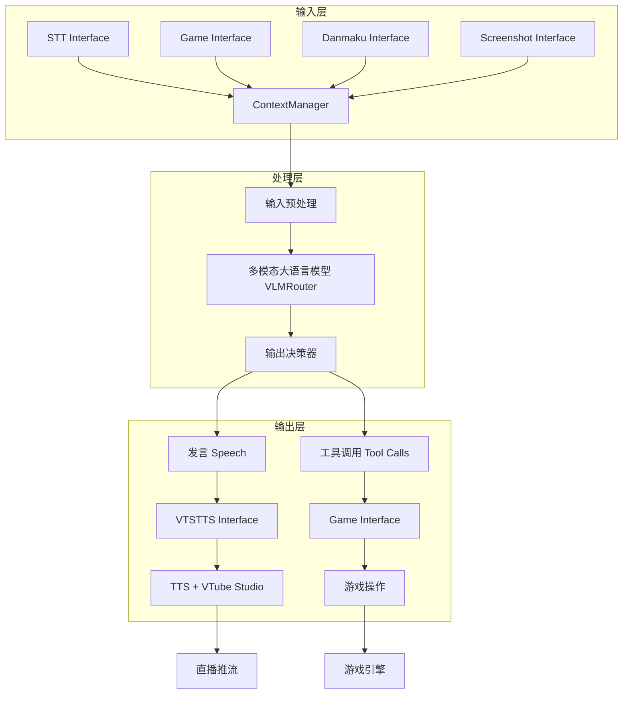
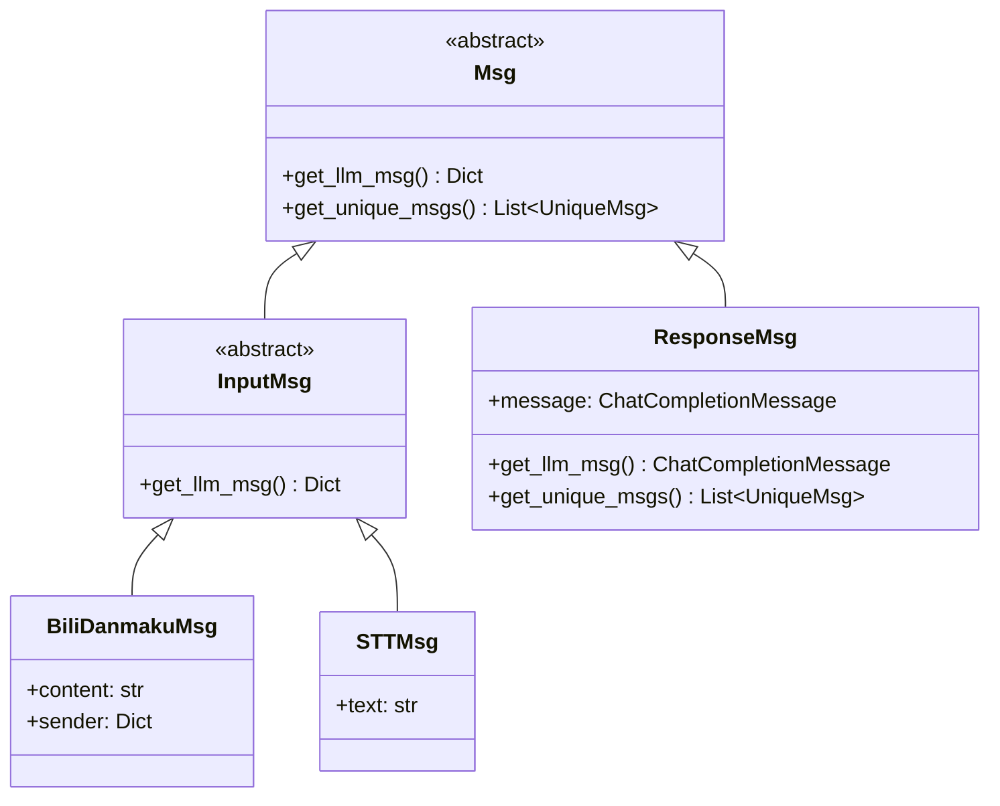

# AI 虚拟主播系统架构设计

## 1. 系统概述

本系统是一个基于多模态大语言模型（Image-Text to Text）的 AI 虚拟主播，支持多种直播平台、多种游戏输入方式，并能够输出发言、感情动作和游戏操作。

### 核心特性

- **多模态输入**：弹幕、游戏画面/状态、STT 语音转文字输入
- **多模态输出**：发言（TTS）、感情动作（VTube Studio）、游戏操作
- **Interface 抽象**：每个 Interface 提供自己的工具描述
- **Async 架构**：所有操作返回 awaitable，支持并发
- **消息去重**：UniqueMsg 自动去重唯一消息，节省 tokens
- **持久记忆**：MemoryInterface 支持跨直播会话保存关键信息（待实现）

## 2. 系统架构图



## 3. 模块设计

### 3.1 Interface 抽象基类

```python
from abc import ABC, abstractmethod
from typing import List, Dict, Any, Awaitable, Tuple, Callable
from .oai_tool import OAIFunction

class Interface(ABC):
    @abstractmethod
    def get_tools(self) -> List[Tuple[OAIFunction, Callable]]:
        """返回该 Interface 提供的工具列表 (OAIFunction, Callable)"""
        pass
    
    async def start(self) -> None:
        """启动 Interface（如连接弹幕服务器、启动录音等）"""
        pass
    
    async def stop(self) -> None:
        """停止 Interface（如断开连接、停止录音等）"""
        pass
    
    def get_system_prompt(self) -> str:
        """返回该 Interface 的 system prompt 片段"""
        return ""
    
    async def on_speech(self, speech: List[Dict[str, Any]]) -> Awaitable:
        """发言时通知，返回 awaitable"""
        pass
    
    def add_to_buffer(self, data: Dict[str, Any]) -> None:
        """将数据加入暂存区，供下次循环使用"""
        pass
    
    def get_buffer(self) -> List[Dict[str, Any]]:
        """获取暂存区内容并清空"""
        pass
    
    async def run_in_threadpool(self, func: callable, *args, **kwargs) -> Any:
        """在线程池中运行同步函数，使用 asyncio.to_thread"""
        pass
    
    @classmethod
    def from_cfg(cls, cfg: Dict) -> "Interface":
        """从配置字典创建 Interface 实例，子类重写"""
        pass
```

### 3.2 消息类层次结构



#### Msg 基类

```python
from abc import ABC, abstractmethod
from typing import List, Dict, Any

class Msg(ABC):
    @abstractmethod
    def get_llm_msg(self, context_manager: "ContextManager" = None) -> Any:
        """返回给 LLM 的消息内容"""
        pass
    
    @abstractmethod
    def get_unique_msgs(self) -> List["UniqueMsg"]:
        """返回唯一消息列表（用于去重）"""
        pass
```

#### InputMsg 抽象基类

```python
class InputMsg(Msg):
    """输入消息抽象基类，所有 Interface 的输入消息都从此类派生"""
    
    @abstractmethod
    def get_llm_msg(self, context_manager: "ContextManager" = None) -> Dict[str, Any]:
        """返回 OpenAI API 兼容的 user 消息格式"""
        pass
```

#### ResponseMsg 类

```python
from openai.types.chat import ChatCompletionMessage

class ResponseMsg(Msg):
    """LLM 回复消息，直接存储 ChatCompletionMessage 对象"""
    
    def __init__(self, message: ChatCompletionMessage):
        self.message = message
    
    def get_llm_msg(self, context_manager: "ContextManager" = None) -> ChatCompletionMessage:
        """直接返回 ChatCompletionMessage 对象"""
        pass
    
    def get_unique_msgs(self) -> List["UniqueMsg"]:
        """ResponseMsg 不需要去重，返回空列表"""
        pass
```

### 3.3 UniqueMsg 和具体实现

```python
from abc import ABC, abstractmethod
from typing import TYPE_CHECKING

if TYPE_CHECKING:
    from .context_manager import ContextManager

class UniqueMsg(ABC):
    """唯一消息，支持去重，使用 get_unique_id() 实现 __hash__ 和 __eq__"""
    
    @abstractmethod
    def get_unique_id(self) -> str:
        """子类必须实现，返回唯一标识符"""
        pass
    
    def __hash__(self) -> int:
        """使用 get_unique_id() 实现哈希"""
        pass
    
    def __eq__(self, other) -> bool:
        """检查类型相同且 get_unique_id() 相同"""
        pass
    
    @abstractmethod
    def get_llm_msg(self, context_manager: "ContextManager" = None) -> Any:
        """返回给 LLM 的消息内容"""
        pass
    
    def should_add_to_context(self, context_manager: "ContextManager") -> bool:
        """决定是否将该消息添加到上下文"""
        pass
```

#### UniqueBiliUserInfo

```python
class UniqueBiliUserInfo(UniqueMsg):
    """Bilibili 用户信息"""
    
    def __init__(self, uid: str, username: str, guard_level: int = 0):
        self.uid = uid
        self.username = username
        self.guard_level = guard_level
    
    def get_unique_id(self) -> str:
        pass
    
    def get_llm_msg(self, context_manager: "ContextManager" = None) -> Dict[str, Any]:
        pass
```

#### UniqueMemory（待实现）

```python
from dataclasses import dataclass

@dataclass
class UniqueMemory(UniqueMsg):
    """唯一记忆，支持跨直播会话的记忆去重和更新"""
    
    category: str
    key: str
    content: str
    updated: bool = False
    
    def get_unique_id(self) -> str:
        pass
    
    def get_llm_msg(self, context_manager: "ContextManager" = None) -> Dict[str, Any]:
        pass
    
    def should_add_to_context(self, context_manager: "ContextManager") -> bool:
        """自定义记忆添加逻辑，支持内容更新检测"""
        pass
```

### 3.4 ContextManager 上下文管理器

```python
from typing import List, Dict, Union

class ContextManager:
    """上下文管理器，管理输入消息和回复消息"""
    
    def __init__(self, system_prompt: str):
        self.system_prompt = system_prompt
        self.msgs: List[Union[InputMsg, ResponseMsg]] = []
        self.unique_msgs: Dict[UniqueMsg, UniqueMsg] = {}
        self.stage1_msgs: List[Union[Any, ResponseMsg]] = []
    
    def add_msg(self, msg: Union[InputMsg, ResponseMsg]) -> None:
        """添加消息（增量式更新 stage1_msgs）"""
        pass
    
    def get_openai_messages(self) -> List[Dict[str, Any]]:
        """返回 OpenAI API 兼容的消息列表（完整序列化）"""
        pass
    
    def trim_by_round(self, ratio: float) -> None:
        """按对话轮次剪裁，ratio 为保留比例（0-1）"""
        pass
```

### 3.5 序列化器（Serializer）

```mermaid
flowchart LR
    A[ContextManager.stage1_msgs<br/>List[Any | ResponseMsg]] -->|Stage 1.5| B[serialize_message_1to15<br/>List[str | ImageObject | ResponseMsg]]
    B -->|Stage 2| C[serialize_message_1to2<br/>OpenAI Message List]
```

#### ImageObject 定义

```python
from dataclasses import dataclass

@dataclass
class ImageObject:
    """图片对象，包含 base64 编码的图片数据"""
    image_id: str
    url: str  # 完整 data URL 格式：data:{mime};base64,{b64}
```

#### Stage 1.5: serialize_message_1to15

```python
from typing import List, Union, Any, Dict
from .msg import ResponseMsg

STAGE15_T = List[Union[str, ImageObject, ResponseMsg, ChatCompletionMessage]]

def serialize_message_1to15(stage1_messages: List[Any | ResponseMsg]) -> STAGE15_T:
    """
    Stage 1.5: 将任意类型递归序列化为字符串、ImageObject 或 ResponseMsg
    
    规则：
    - str: 添加带引号的字符串
    - int/float/bool/None: 转换为 JSON 格式字符串
    - dict: 递归处理 key-value
    - list: 递归处理元素
    - ImageObject: 保持 ImageObject 对象
    - ResponseMsg: 直接添加到 buffer（保持对象）
    """
    pass
```

#### Stage 2: serialize_message_1to2

```python
def serialize_message_1to2(stage1_messages: List[Any | ResponseMsg]) -> List[Dict]:
    """
    Stage 2: 将 Stage 1 消息转换为 OpenAI Message 格式
    
    流程：
    1. 调用 serialize_message_1to15() 得到 Stage 1.5
    2. 合并相邻字符串
    3. 转换为 OpenAI Message 格式
    """
    pass
```

### 3.6 VLM Client 和 Router

```python
from dataclasses import dataclass, field
from typing import List, Dict, Any, Optional, Literal

@dataclass
class VLMConfig:
    """单个 VLM 模型配置"""
    name: str               # 唯一名称（如 "localQwen120B"）
    endpoint: str           # API 端点
    model: str              # 模型名称（用于 API 调用）
    enabled: bool = True
    api_key: str = ""
    timeout: int = 60
    priority: int = 0
    extra_kwargs: Dict[str, Any] = field(default_factory=dict)

class VLMRouter:
    """VLM 路由管理器，支持 ordered 和 balanced 路由策略"""
    
    def __init__(self, model_configs: Dict[str, VLMConfig], route_policy: Literal["ordered", "balanced"] = "ordered"):
        pass
    
    def _get_sorted_models(self) -> List[str]:
        """获取排序后的模型列表"""
        pass
    
    def chat(self, messages: List[Dict[str, Any]], tools: Optional[List[Dict[str, Any]]] = None) -> Any:
        """调用 VLM 进行聊天（同步）"""
        pass
    
    async def chat_async(self, messages: List[Dict[str, Any]], tools: Optional[List[Dict[str, Any]]] = None) -> Any:
        """调用 VLM 进行聊天（异步）"""
        pass

def load_vlm_router(config: Dict[str, Any]) -> VLMRouter:
    """从配置文件加载 VLMRouter"""
    pass
```

配置文件格式（使用 mapping 而非 list）：

```yaml
vlm:
  route_policy: ordered  # 或 balanced
  models:
    localQwen120B:
      endpoint: http://192.168.31.117:8090/v1
      model: Qwen3.5
      enabled: true
      priority: 1
      extra_kwargs:
        extra_body:
          chat_template_kwargs:
            enable_thinking: true
    
    localQwen27B:
      endpoint: http://192.168.31.117:8091/v1
      model: Qwen3.5-7B
      enabled: true
      priority: 2
    
    openrouter_claude:
      api_key: "$env:{OPENROUTER_APIKEY}"
      endpoint: "https://openrouter.ai/api/v1"
      model: anthropic/claude-opus-4.6
      enabled: false
      priority: 100
```

### 3.7 输入 Interface

#### STT Interface

```python
class STTInterface(Interface):
    """语音转文字 Interface"""
    
    def __init__(self, backend: STTBackend):
        pass
    
    @classmethod
    def from_cfg(cls, cfg: Dict) -> "STTInterface":
        pass
    
    async def collect_input(self) -> List[InputMsg]:
        pass
    
    def get_system_prompt(self) -> str:
        pass
```

```python
class STTBackend(ABC):
    """STT 后端抽象基类"""
    
    @abstractmethod
    async def start(self) -> None:
        pass
    
    @abstractmethod
    async def stop(self) -> None:
        pass
    
    @abstractmethod
    def collect_input(self) -> List[str]:
        pass
```

```python
class STTMsg(InputMsg):
    """STT 识别消息"""
    
    def __init__(self, text: str, timestamp: float = None):
        pass
    
    def get_llm_msg(self, context_manager: "ContextManager" = None) -> Dict[str, Any]:
        pass
    
    def get_unique_msgs(self) -> List[UniqueMsg]:
        pass
```

#### Screenshot Interface

```python
class ScreenshotInterface(Interface):
    """屏幕截图 Interface，定期截图并作为输入消息发送"""
    
    def __init__(self, frame_rate: float = 1.0, max_frame: int = 5):
        pass
    
    @classmethod
    def from_cfg(cls, cfg: Dict) -> "ScreenshotInterface":
        pass
    
    async def start(self) -> None:
        pass
    
    async def collect_input(self) -> List[InputMsg]:
        pass
    
    def get_system_prompt(self) -> str:
        pass
```

#### BiliDanmaku Interface

```python
class BiliDanmakuInterface(Interface):
    """Bilibili 弹幕 Interface，使用 blivedm 库"""
    
    def __init__(self, roomids: List[int], bili_sessdata: str = "", debug_danmaku_content: bool = False):
        pass
    
    @classmethod
    def from_cfg(cls, cfg: Dict) -> "BiliDanmakuInterface":
        pass
    
    async def start(self) -> None:
        pass
    
    async def stop(self) -> None:
        pass
    
    async def collect_input(self) -> List[InputMsg]:
        pass
    
    def get_system_prompt(self) -> str:
        pass
```

```python
class BiliDanmakuMsg(InputMsg):
    """Bilibili 弹幕消息"""
    
    def __init__(self, content: str, sender: Dict[str, Any]):
        pass
    
    def get_llm_msg(self, context_manager: "ContextManager" = None) -> Dict[str, Any]:
        pass
    
    def get_unique_msgs(self) -> List[UniqueMsg]:
        pass
```

### 3.8 输出 Interface

#### VTSTTS Interface（TTS + VTube Studio 集成）

```python
class VTSTTSInterface(Interface):
    """TTS + VTube Studio 集成 Interface"""
    
    def __init__(self, player: AudioWithVTS, tts_backend: TTSBackend):
        pass
    
    @classmethod
    def from_cfg(cls, cfg: Dict) -> "VTSTTSInterface":
        pass
    
    async def start(self) -> None:
        pass
    
    async def stop(self) -> None:
        pass
    
    async def on_speech(self, speech: List[Tuple[str, str]]) -> None:
        """处理 LLM 的发言，(emotion, content) 对"""
        pass
    
    def get_system_prompt(self) -> str:
        pass
```

```python
class AudioWithVTS:
    """音频播放器 + VTube Studio 参数控制"""
    
    def __init__(self, vts: pyvts.vts, emotion_config: Dict, maxsize=1, subtitle_filename=None):
        pass
    
    async def start(self) -> None:
        pass
    
    async def stop(self) -> None:
        pass
    
    async def vts_worker(self) -> None:
        """VTS 参数更新循环"""
        pass
    
    async def play_worker(self) -> None:
        """音频播放循环"""
        pass
```

```python
class TTSBackend(ABC):
    """TTS 后端抽象基类：生成音频文件并放入播放队列"""
    
    def __init__(self, player: AudioWithVTS, maxsize=5):
        pass
    
    async def start(self) -> None:
        pass
    
    async def stop(self) -> None:
        pass
    
    async def worker(self) -> None:
        """TTS 生成 worker"""
        pass
    
    @abstractmethod
    async def _generate_tts_single(self, emotion: str, content: str) -> str:
        """生成单个音频文件，返回本地路径"""
        pass
```

#### Live2D 参数控制

```python
class ActionProtocol(Protocol):
    def __call__(self, t: float) -> float:
        pass

class ActionConstant:
    """常值函数"""
    def __init__(self, v: float):
        pass
    def __call__(self, t: float) -> float:
        pass

class ActionLoop:
    """循环函数，按时间插值"""
    def __init__(self, values: List[float], durations: List[float]):
        pass
    def __call__(self, t: float) -> float:
        pass

class ActionRand:
    """随机函数，生成随机值并插值"""
    def __init__(self, v_min: float, v_max: float, dur_min: float, dur_max: float, t_interp: float):
        pass
    def __call__(self, t: float) -> float:
        pass

class ActionStatus:
    """参数 -> 动作函数映射"""
    
    def __init__(self, map: Dict[str, ActionProtocol]):
        pass
    
    @classmethod
    def from_config(cls, cfg: List[Dict], default: "ActionStatus" = None) -> "ActionStatus":
        """从配置文件创建 ActionStatus"""
        pass
    
    def update(self, other: "ActionStatus") -> None:
        """更新参数映射"""
        pass
```

### 3.9 配置管理

#### 特殊占位符

配置文件支持以下三种特殊占位符：

1. **`$env:{VARNAME}`** - 替换为环境变量值
2. **`$source:{relative/path/to/file.yaml}`** - 读取另一个 YAML 文件的内容并合并
3. **`$source_txt:{relative/path/to/file.txt}`** - 读取文本文件内容作为字符串值

```python
def load_config(fn: str) -> Dict[str, Any]:
    """加载配置文件，并替换占位符"""
    pass

def resolve_placeholders(obj: Any, base_dir: str = None) -> Any:
    """递归替换占位符"""
    pass
```

#### Interface 工厂设计

```python
_INTERFACE_REGISTRY: Dict[str, Type[Interface]] = {}

def register_interface(name: str):
    """装饰器：注册 Interface 类型"""
    pass

def load_interface(interface_cfg: Dict[str, Any]) -> Interface:
    """根据 type 加载 Interface"""
    pass

def load_interfaces(cfg: Dict[str, Dict]) -> Dict[str, Interface]:
    """加载所有启用的 Interface"""
    pass
```

### 3.10 主循环

```python
async def main(yaml_fn: str) -> None:
    """主循环"""
    # 1. 加载配置
    # 2. 初始化 VLM router
    # 3. 初始化 interfaces
    # 4. 收集 system prompts 和 tools
    # 5. 创建 ContextManager
    # 6. 启动所有 interfaces
    # 7. 主循环：collect_input -> VLM chat -> 处理 tool calls -> on_speech
    # 8. 停止所有 interfaces
    pass
```

## 4. 项目结构

```
caibao-bili-vup/
├── src/
│   ├── __init__.py
│   ├── _main_draft.py              # 主循环草稿
│   └── core/
│       ├── __init__.py
│       ├── config_loader.py        # 配置加载器
│       ├── context_manager.py      # 上下文管理器
│       ├── image.py                # 图片对象和工具
│       ├── msg.py                  # 消息类层次结构
│       ├── oai_tool.py             # OAIFunction, OAIParam
│       ├── serializer.py           # 序列化器
│       ├── vlm_client.py           # VLM Client 和 Router
│       ├── audio/
│       │   ├── __init__.py
│       │   └── play.py             # 音频播放
│       └── interfaces/
│           ├── __init__.py
│           ├── base.py             # Interface 基类
│           ├── loader.py           # Interface 工厂
│           ├── danmaku.py          # BiliDanmakuInterface
│           ├── screenshot.py       # ScreenshotInterface
│           ├── stt.py              # STTInterface
│           ├── tts.py              # TTSInterface
│           └── vts_tts.py          # VTSTTSInterface
├── configs/
│   └── {config_name}/
│       └── config.yaml
├── plans/
│   ├── architecture.md
│   ├── tts_stt_design.md
│   └── live2d_control.md
├── blivedm/                        # blivedm 库
├── pyvts/                          # pyvts 库
└── VTubeStudioOfficialAPIDoc/      # VTS 官方文档
```

## 5. 待实现清单

- [x] Interface 基类实现
- [x] ContextManager 实现
- [x] UniqueMsg 基类及派生类（UniqueBiliUserInfo）
- [x] STT Interface 实现（SherpaNCNN 后端）
- [x] Screenshot Interface 实现
- [x] BiliDanmaku Interface 实现（blivedm 集成）
- [x] TTS Interface 实现（IndexTTS 后端）
- [x] VTSTTS Interface 实现（TTS + VTS 集成）
- [x] VLM Router 实现（多模型路由）
- [x] 配置加载器（占位符替换）
- [x] Interface 工厂（注册系统）
- [ ] MemoryInterface 实现
- [ ] Game Interface 实现

---

架构设计文档完成。
