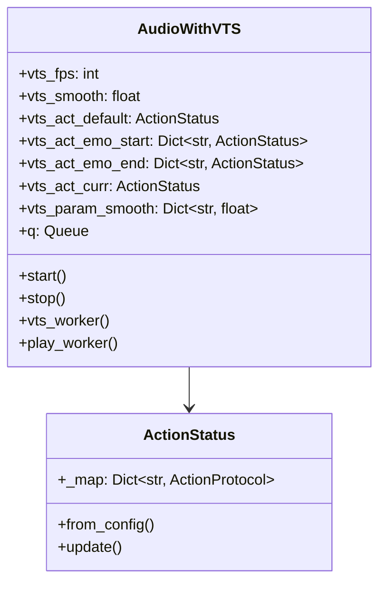
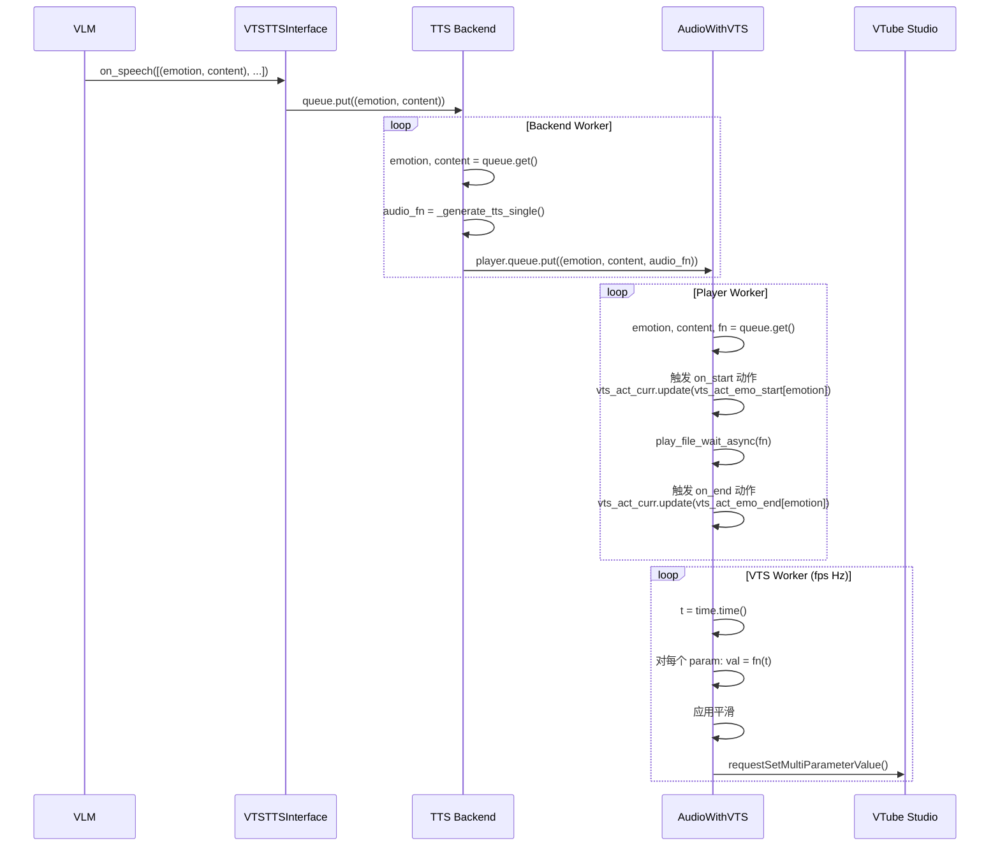

# Live2D 模型控制设计

## 概述

本文档描述如何通过 VTube Studio API 控制 Live2D 模型，实现：
1. **待机动作**：让模型自然地进行随机动作，避免定着不动
2. **发言动作**：与 TTS 语音同步，控制张嘴闭嘴和情感表达

## 性能验证结果

### 已验证

- [x] **30Hz 更新频率足够流畅** - 经测试，30Hz 的 API 调用频率已能提供流畅的动画效果
- [x] **VTube Studio 不会自动插值** - 需要客户端实现平滑处理
- [x] **InjectParameterDataRequest 可用** - 可通过 pyvts 构造请求体控制参数

### 平滑处理

客户端平滑公式：
```python
smooth_val += (target - smooth_val) * min(1, smooth * fps)
```

其中：
- `smooth_val`: 当前平滑后的值
- `target`: 目标值（从 Action 函数计算得到）
- `smooth`: 平滑系数（0-1，越大越平滑）
- `fps`: 更新频率

## VTube Studio API 能力

### 参数控制

通过 `requestSetMultiParameterValue` 批量设置多个参数值：

```python
class VTSRequest:
    def requestSetMultiParameterValue(self, parameters: List[str], values: List[float]) -> dict:
        """批量设置多个参数值"""
        pass
```

### 使用 pyvts 库

```python
import pyvts

async def connect():
    vts = pyvts.vts(host="localhost", port=8003)
    await vts.connect()
    await vts.request_authenticate_token()
    return vts

async def set_params(vts: pyvts.vts, params: List[str], values: List[float]):
    request = vts.vts_request.requestSetMultiParameterValue(params, values)
    await vts.request(request)
```

## 参数控制设计

### 核心思想

所有参数控制抽象为 **timestamp -> param_value** 的映射函数：

- 闭嘴：常值函数 = 0
- 张嘴闭嘴：周期函数
- 脸红：常值函数
- 随机动作：随机函数

维护 `mapping(param_name) -> time_value_mapping_fn` 的状态，通过触发事件改变参数使用的函数。

### Action 函数类型

```python
class ActionProtocol(Protocol):
    def __call__(self, t: float) -> float:
        pass

class ActionConstant:
    """常值函数"""
    def __init__(self, v: float):
        pass
    def __call__(self, t: float) -> float:
        pass

class ActionLoop:
    """循环函数，按时间插值"""
    def __init__(self, values: List[float], durations: List[float]):
        pass
    def __call__(self, t: float) -> float:
        pass

class ActionRand:
    """随机函数，生成随机值并插值"""
    def __init__(self, v_min: float, v_max: float, dur_min: float, dur_max: float, t_interp: float):
        pass
    def __call__(self, t: float) -> float:
        pass

class ActionStatus:
    """参数 -> 动作函数映射"""
    
    def __init__(self, map: Dict[str, ActionProtocol]):
        pass
    
    @classmethod
    def from_config(cls, cfg: List[Dict], default: "ActionStatus" = None) -> "ActionStatus":
        """从配置文件创建 ActionStatus
        
        支持的类型：
        - constant: 常值
        - loop: 循环插值
        - random: 随机值
        - reset: 重置为默认值
        """
        pass
    
    def update(self, other: "ActionStatus") -> None:
        """更新参数映射"""
        pass
```

### 配置文件格式

```yaml
emotion:
  fps: 40              # VTS 参数更新频率
  smooth: 1            # 平滑系数
  default:             # 默认动作（待机）
    - params: [MouthOpen]
      type: constant
      value: 0
    - params: [FaceAngleX, FaceAngleY]
      type: random
      range: [-30, 30]
      duration: [3, 7]
      interp: 0.5
  speech:              # 发言时的动作
    common:            # 所有 emotion 通用
      on_start:        # 发言开始时触发
        - params: [MouthOpen]
          type: loop
          value: [0.0, 1.0]
          duration: [0.3, 0.3]
      on_end:          # 发言结束时触发
        - params: [MouthOpen]
          type: reset
    happy:             # 特定 emotion
      on_start:
        - params: [MouthSmile]
          type: constant
          value: 1
```

### Action 类型说明

| 类型 | 说明 | 配置参数 |
|------|------|----------|
| `constant` | 常值函数 | `value: float` |
| `loop` | 循环插值 | `value: List[float]`, `duration: List[float]` |
| `random` | 随机值 | `range: [min, max]`, `duration: [min, max]`, `interp: float` |
| `reset` | 重置为默认值 | 无 |

## AudioWithVTS 实现

### 架构



### 工作流程



### 代码结构

```python
class AudioWithVTS:
    """音频播放器 + VTube Studio 参数控制"""
    
    def __init__(self, vts: pyvts.vts, emotion_config: Dict, maxsize=1, subtitle_filename=None):
        """
        Args:
            vts: pyvts.vts 实例
            emotion_config: 情感配置字典
            maxsize: 队列最大大小
            subtitle_filename: 字幕文件路径（可选）
        """
        pass
    
    async def start(self) -> None:
        """启动 worker"""
        pass
    
    async def stop(self) -> None:
        """停止 worker"""
        pass
    
    async def vts_worker(self) -> None:
        """VTS 参数更新循环（fps Hz）
        
        1. 计算每个参数的目标值：val = fn(time.time())
        2. 应用平滑：smooth_val += (val - smooth_val) * min(1, smooth * fps)
        3. 批量发送：requestSetMultiParameterValue()
        """
        pass
    
    async def play_worker(self) -> None:
        """音频播放循环
        
        1. 从队列获取 (emotion, content, audio_fn)
        2. 触发 on_start 动作：vts_act_curr.update(vts_act_emo_start[emotion])
        3. 播放音频：play_file_wait_async(audio_fn)
        4. 触发 on_end 动作：vts_act_curr.update(vts_act_emo_end[emotion])
        """
        pass
```

## 实现状态

- [x] 验证 30Hz 更新频率足够流畅
- [x] 验证 VTube Studio 不会自动插值
- [x] 验证 InjectParameterDataRequest 可用
- [x] ActionConstant 实现
- [x] ActionLoop 实现
- [x] ActionRand 实现
- [x] ActionStatus 实现
- [x] AudioWithVTS 实现
- [x] VTSTTSInterface 实现
- [ ] 更精确的口型同步（使用音素识别）
- [ ] 更多预设情感动作

## 参考资料

- [VTube Studio API 文档](./VTubeStudioOfficialAPIDoc/)
- [pyvts 库](./pyvts/)
- Cubism Editor 教程

---

文档完成。
