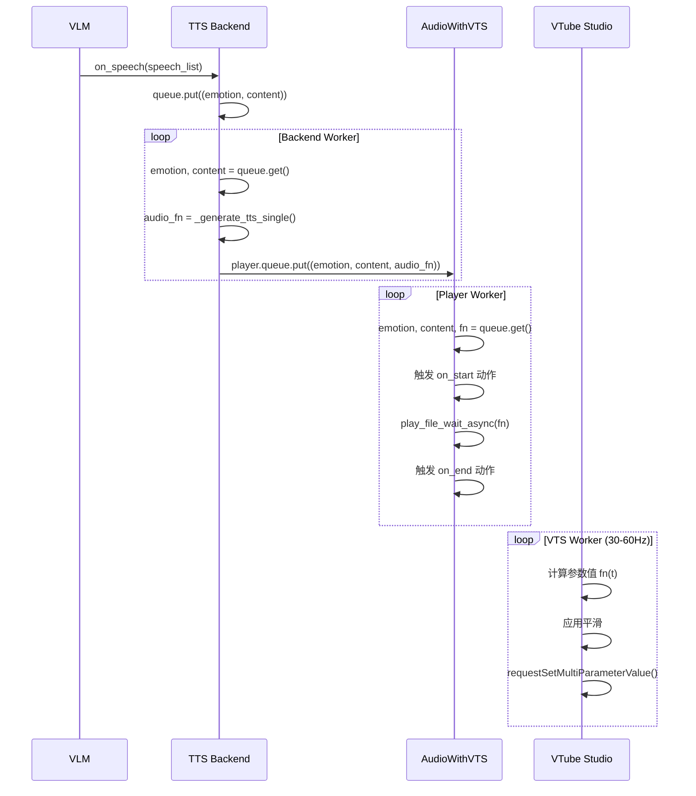

# TTS/STT Interface 设计文档

## 概述

实现语音对话功能，让 AI 主播能够：
1. **听**：通过 STT Interface 识别用户语音输入
2. **说**：通过 TTS Interface 将 LLM 回复转换为语音输出
3. **表情同步**：通过 VTSTTS Interface 实现 TTS 与 VTube Studio 表情同步

## 架构设计

### 1. 独立 Interface 设计

```
┌─────────────────────────────────────────────────────────────┐
│                      Main Loop                               │
│  ┌──────────────┐    ┌──────────────┐    ┌──────────────┐  │
│  │ STTInterface │    │ Screenshot   │    │ BiliDanmaku  │  │
│  │  (collect)   │    │ (collect)    │    │ (collect)    │  │
│  └──────┬───────┘    └──────┬───────┘    └──────┬───────┘  │
│         │                   │                   │           │
│         └───────────────────┴───────────────────┘           │
│                           ↓                                 │
│                    ┌──────────────┐                         │
│                    │   Context    │                         │
│                    │  Manager     │                         │
│                    └──────┬───────┘                         │
│                           ↓                                 │
│                    ┌──────────────┐                         │
│                    │    VLM       │                         │
│                    └──────┬───────┘                         │
│                           ↓                                 │
│         ┌─────────────────┴─────────────────┐              │
│         ↓                                   ↓              │
│  ┌──────────────┐                    ┌──────────────┐      │
│  │ VTSTTSInterface │                    │   Other      │      │
│  │  (on_speech) │                    │  Interfaces  │      │
│  └──────────────┘                    └──────────────┘      │
│         ↓                                                   │
│  ┌──────────────┐                                          │
│  │ TTS Backend  │ 生产 - 消费模型                              │
│  │  (worker)    │ VLM → TTS → Player 并行处理                │
│  └──────┬───────┘                                          │
│         ↓                                                   │
│  ┌──────────────┐                                          │
│  │ AudioWithVTS │ 播放音频 + VTS 参数控制                       │
│  │  (player)    │                                          │
│  └──────────────┘                                          │
└─────────────────────────────────────────────────────────────┘
```

### 2. STT Interface

#### 职责

- 监听麦克风输入
- 将语音转换为文字
- 通过 `collect_input()` 返回识别的文字消息

#### 配置项

```yaml
interfaces:
  stt:
    type: stt
    stt_type: sherpa_ncnn  # 支持的类型见下方
    # 后端特定配置...
```

#### STT 后端接口

```python
class STTBackend(ABC):
    """STT 后端抽象基类"""
    
    @abstractmethod
    async def start(self) -> None:
        """开始识别"""
        pass
    
    @abstractmethod
    async def stop(self) -> None:
        """停止识别"""
        pass
    
    @abstractmethod
    def collect_input(self) -> List[str]:
        """收集识别结果并清空"""
        pass
```

#### 支持的 STT 后端

1. **SherpaNCNN**（`sherpa_ncnn`）- 已实现
   - 使用 sherpa-ncnn 库
   - 本地运行，低延迟
   - 配置：`model_dir`, `num_threads`, `device_idx`

2. **WhisperLocal**（`whisper_local`，预留）
3. **AzureSTT**（`azure_stt`，预留）
4. **AliyunSTT**（`aliyun_stt`，预留）

#### STTMsg 消息格式

```python
class STTMsg(InputMsg):
    """STT 识别消息"""
    
    def __init__(self, text: str, timestamp: float = None):
        pass
    
    def get_llm_msg(self, context_manager: "ContextManager" = None) -> Dict[str, Any]:
        """返回 {"type": "stt", "content": text, "timestamp": ts}"""
        pass
    
    def get_unique_msgs(self) -> List[UniqueMsg]:
        """STT 消息不去重，返回空列表"""
        pass
```

#### STTInterface 实现

```python
@register_interface("stt")
class STTInterface(Interface):
    """STT (Speech-to-Text) Interface"""
    
    def __init__(self, backend: STTBackend):
        pass
    
    @classmethod
    def from_cfg(cls, cfg: Dict) -> "STTInterface":
        pass
    
    async def collect_input(self) -> List[InputMsg]:
        pass
    
    def get_system_prompt(self) -> str:
        pass
```

### 3. TTS Interface

#### 职责

- 接收 LLM 的发言内容（通过 `on_speech()`）
- 将文本转换为语音
- 播放语音

#### 配置项

```yaml
interfaces:
  tts:
    type: tts
    tts_type: index_tts  # 支持的类型见下方
    # 后端特定配置...
```

#### TTS 后端接口（生产 - 消费模型）

```python
class TTSBackend(ABC):
    """TTS 后端抽象基类：生成音频文件并放入播放队列"""
    
    def __init__(self, player: AudioWithVTS, maxsize=5):
        pass
    
    async def start(self) -> None:
        pass
    
    async def stop(self) -> None:
        pass
    
    async def worker(self) -> None:
        """TTS 生成 worker：从队列取任务，生成音频，放入 player 队列"""
        pass
    
    @abstractmethod
    async def _generate_tts_single(self, emotion: str, content: str) -> str:
        """生成单个音频文件，返回本地路径"""
        pass
```

#### 支持的 TTS 后端

1. **IndexTTS**（`index_tts`）- 已实现
   - 调用 IndexTTS API 端口
   - 配置：`endpoint`, `voice`, `allow_emotion`

2. **LocalTTS**（`local_tts`，预留）
3. **AzureTTS**（`azure_tts`，预留）
4. **EdgeTTS**（`edge_tts`，预留）

#### TTSInterface 实现

```python
@register_interface("tts")
class TTSInterface(Interface):
    """TTS (Text-to-Speech) Interface"""
    
    def __init__(self, player: QueuedPlayer, tts_backend: TTSBackend):
        pass
    
    @classmethod
    def from_cfg(cls, cfg: Dict) -> "TTSInterface":
        pass
    
    async def start(self) -> None:
        pass
    
    async def stop(self) -> None:
        pass
    
    async def on_speech(self, speech: List[Tuple[str, str]]) -> None:
        """处理 LLM 的发言，(emotion, content) 对"""
        pass
    
    def get_system_prompt(self) -> str:
        pass
```

### 4. VTSTTS Interface（TTS + VTube Studio 集成）

#### 职责

- 整合 TTS 和 VTube Studio 控制
- 根据 emotion 参数控制 Live2D 模型表情
- 同步 TTS 播放和 VTS 动作

#### 配置项

```yaml
interfaces:
  vts_tts:
    type: vts_tts
    tts_type: index_tts
    endpoint: http://192.168.31.117:8096
    voice: caicai
    allow_emotion: false
    player_queue_size: 1
    backend_queue_size: 0
    vts:
      client:
        plugin_name: "caibao"
        developer: "TkskKurumi"
        auth_token_pth: "vts_token.txt"
        host: localhost
        port: 8003
      emotion:
        fps: 40
        smooth: 1
        default:
          - params: [MouthOpen]
            type: constant
            value: 0
        speech:
          common:
            on_start:
              - params: [MouthOpen]
                type: loop
                value: [0.0, 1.0]
                duration: [0.3, 0.3]
            on_end:
              - params: [MouthOpen]
                type: reset
```

#### 生产 - 消费模型



#### VTSTTSInterface 实现

```python
@register_interface("vts_tts")
class VTSTTSInterface(Interface):
    """TTS + VTube Studio 集成 Interface"""
    
    def __init__(self, player: AudioWithVTS, tts_backend: TTSBackend):
        pass
    
    @classmethod
    def from_cfg(cls, cfg: Dict) -> "VTSTTSInterface":
        pass
    
    async def start(self) -> None:
        pass
    
    async def stop(self) -> None:
        pass
    
    async def on_speech(self, speech: List[Tuple[str, str]]) -> None:
        """处理 LLM 的发言，(emotion, content) 对"""
        pass
    
    def get_system_prompt(self) -> str:
        pass
```

#### AudioWithVTS 实现

```python
class AudioWithVTS:
    """音频播放器 + VTube Studio 参数控制"""
    
    def __init__(self, vts: pyvts.vts, emotion_config: Dict, maxsize=1, subtitle_filename=None):
        pass
    
    async def start(self) -> None:
        pass
    
    async def stop(self) -> None:
        pass
    
    async def vts_worker(self) -> None:
        """VTS 参数更新循环（30-60Hz）"""
        pass
    
    async def play_worker(self) -> None:
        """音频播放循环"""
        pass
```

### 5. Live2D 参数控制

#### Action 函数类型

```python
class ActionProtocol(Protocol):
    def __call__(self, t: float) -> float:
        pass

class ActionConstant:
    """常值函数"""
    def __init__(self, v: float):
        pass
    def __call__(self, t: float) -> float:
        pass

class ActionLoop:
    """循环函数，按时间插值"""
    def __init__(self, values: List[float], durations: List[float]):
        pass
    def __call__(self, t: float) -> float:
        pass

class ActionRand:
    """随机函数，生成随机值并插值"""
    def __init__(self, v_min: float, v_max: float, dur_min: float, dur_max: float, t_interp: float):
        pass
    def __call__(self, t: float) -> float:
        pass

class ActionStatus:
    """参数 -> 动作函数映射"""
    
    def __init__(self, map: Dict[str, ActionProtocol]):
        pass
    
    @classmethod
    def from_config(cls, cfg: List[Dict], default: "ActionStatus" = None) -> "ActionStatus":
        """从配置文件创建 ActionStatus"""
        pass
    
    def update(self, other: "ActionStatus") -> None:
        """更新参数映射"""
        pass
```

#### 配置文件格式

```yaml
emotion:
  fps: 40              # VTS 参数更新频率
  smooth: 1            # 平滑系数
  default:             # 默认动作
    - params: [MouthOpen]
      type: constant
      value: 0
    - params: [FaceAngleX, FaceAngleY]
      type: random
      range: [-30, 30]
      duration: [3, 7]
  speech:              # 发言时的动作
    common:            # 所有 emotion 通用
      on_start:
        - params: [MouthOpen]
          type: loop
          value: [0.0, 1.0]
          duration: [0.3, 0.3]
      on_end:
        - params: [MouthOpen]
          type: reset
    happy:             # 特定 emotion
      on_start:
        - params: [MouthSmile]
          type: constant
          value: 1
```

### 6. 工作流程

#### STT 流程

```
用户语音
    ↓
[STT Interface.start()] 启动识别
    ↓
[STT Backend] 麦克风录音 → 语音识别
    ↓
[STT Interface] 创建 STTMsg 加入缓冲区
    ↓
[Main Loop] collect_input() → 返回 STTMsg 列表
    ↓
[Main Loop] ContextManager.add_msg(STTMsg)
```

#### TTS 流程（生产 - 消费模型）

```
[VLM] 生成回复
    ↓
[Main Loop] ResponseMsg
    ↓
[Main Loop] VTSTTSInterface.on_speech(speech)
    ↓
[TTS Backend] queue.put((emotion, content))
    ↓
[TTS Backend Worker] 生成音频 → player.queue.put((emotion, content, audio_fn))
    ↓
[AudioWithVTS Worker] 触发 on_start 动作
    ↓
[AudioWithVTS] play_file_wait_async(audio_fn)
    ↓
[AudioWithVTS] 触发 on_end 动作
```

### 7. 注意事项

1. **STT 延迟**：持续监听可能产生大量识别结果，需要合理的去重和过滤机制
2. **TTS 延迟**：语音合成需要时间，使用生产 - 消费模型优化 first-audio-latency
3. **打断机制**：用户说话时可能需要打断当前 TTS 播放（未来功能）
4. **噪声处理**：STT 前可能需要噪声抑制处理（未来功能）
5. **多语言支持**：配置不同语言模型（未来功能）
6. **VTS 更新频率**：30Hz 已足够流畅，可配置调整

### 8. 实现状态

- [x] STTBackend 基类定义
- [x] STTSherpaNCNNBackend 实现
- [x] STTMsg 消息类
- [x] STTInterface 实现
- [x] TTSBackend 基类定义（生产 - 消费模型）
- [x] IndexTTSAPIBackend 实现
- [x] TTSInterface 实现
- [x] AudioWithVTS 实现
- [x] VTSTTSInterface 实现
- [x] ActionStatus 及派生类实现
- [ ] 其他 STT 后端（预留）
- [ ] 其他 TTS 后端（预留）

---

文档完成。
